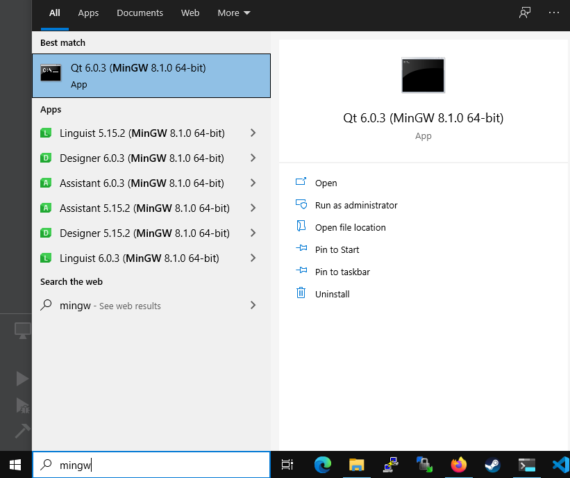

# Instalacja `vcpkg`

## Instalacja `git`

Windows:

- Zainstaluj (lub upewnij się, że masz zainstalowane) Git4Windows - <https://gitforwindows.org/>

Linux

- skorzystaj z natywnego menadżera paczek w Linuksie i zainstaluj `git`

## Instalacja vcpkg pod MinGW od QtCreator

- uruchom konsolę dla kompilatora MinGW zainstalowanego razem z QT Creator:


- przejdź do katalogu gdzie chcesz trzymać swój projekt wykonując następujące polecenia:

```cmd
cd e:\uczelnia\psio\2020_2021
dir
```


- Z racji tego, że `vcpkg` będziemy chcieli używać w więcej niż jednym projekcie przejdziemy do katalogu wyżej:

```cmd
cd ..
```


- Otwórz stronę `vcpkg` na `github.org` w przeglądarce: <https://github.com/Microsoft/vcpkg>, kliknij na przycisk `Code` i skopiuj URL


- W konsoli natomiast wpisz polecenie:

```cmd
git clone https://github.com/microsoft/vcpkg.git
```

Powinno nastąpić klonowanie repozytorium z menadżerem paczek `vcpkg` i powinno się uzyskać następujący wynik:


- Uruchom polecenie `.\vcpkg\bootstrap-vcpkg.bat` w celu inicjalizacji menadżera paczek.

```cmd
.\vcpkg\bootstrap-vcpkg.bat
```


- Gratulacje, menadżer paczek powinen zostać poprawnie zainstalowany. Teraz przejdziemy do obsługi `vcpkg` i instalacji paczek.

- Listowanie paczek

```cmd
./vcpkg/vcpkg.exe list
```

wyświetli listę paczek już zainstalowanych, powinna ona być pusta.

- Szukanie paczek

```cmd
./vcpkg/vcpkg.exe search sfml
```


- Zainstaluj paczkę `sfml`

```cmd
./vcpkg/vcpkg.exe install sfml-x64-mingw-static
```

Nastąpie kompilacja biblioteki `sfml` oraz wymaganych zależności.

*Uwaga* Należy przy instalacji paczek dla `MinGW` należy pamiętać o dodaniu tzw. tripletu do nazwy paczki `x64-mingw-static`

Wynik powinien być podobny do poniższego:


```text
The package sfml provides CMake targets:

    find_package(SFML COMPONENTS system window graphics CONFIG REQUIRED)
    target_link_libraries(main PRIVATE sfml-system sfml-network sfml-graphics sfml-window)

    # If you want SFML to provide an implementation of main():
    target_link_libraries(main PRIVATE sfml-main)
```

## Integracja `vcpkg` z projektem w QtCreator

- Otwórz swój projekt w QtCreator


- Kliknij ikonę `Projects` na pasku po lewej stronie:


- W międzyczasie, w konsoli z `vcpkg` uruchom polecenie:

```cmd
./vcpkg/vcpkg.exe integrate install
```

Na ekranie pojawi się polecenie/argument jaki będziemy musieli dodać do projektu w QtCreator. W moim przypadku będzie to:

```cmake
-DCMAKE_TOOLCHAIN_FILE=E:/Uczelnia/psio/vcpkg/scripts/buildsystems/vcpkg.cmake
```


- Skopiuj ten argument oraz (identyfikacja tripletu):

```cmake
-DVCPKG_TARGET_TRIPLET=x64-mingw-static
```

i wklej w pole `Initial CMake parameters` w QtCreator w tej kolejności:

```cmake
-DVCPKG_TARGET_TRIPLET=x64-mingw-static
-DCMAKE_TOOLCHAIN_FILE=E:/Uczelnia/psio/vcpkg/scripts/buildsystems/vcpkg.cmake
```


- Dla pewności, że wszystko się odświeży w projekcie z menu `Build` wybierz `Clean CMake Configuration`


oraz `Run CMake`:


## Dodawanie biblioteki `sfml` do projektu

- Otwórz plik `CMakeLists.txt`, może on wyglądać podobniej jak poniżej:

```cmake
cmake_minimum_required(VERSION 3.5)

project(PSiO LANGUAGES CXX)

set(CMAKE_CXX_STANDARD 20)
set(CMAKE_CXX_STANDARD_REQUIRED ON)

add_executable(Lab01 Lab01/main.cpp)
add_executable(Lab02 Lab02/main.cpp)
add_executable(Lab03 Lab03/main.cpp)
add_executable(Lab04 Lab04/main.cpp)
add_executable(Lab06
    Lab06/main.cpp
    Lab06/histogram.cpp
    Lab06/histogram.h
)
set_target_properties(Lab01 Lab02 Lab03 Lab04 Lab06
    PROPERTIES
    CXX_EXTENSIONS OFF
)

if (CMAKE_COMPILER_IS_GNUCXX)
    set(CMAKE_CXX_FLAGS "${CMAKE_CXX_FLAGS} -pedantic")
endif()
```

i dodaj na końcu to, co `vcpkg` wyświetlił po instalacji paczki `sfml` zmieniając nazwę pliku wykonywalnego z `main` na na przykład `Lab06` (w zależności jaki projekt się rozwija).

```cmake
find_package(SFML COMPONENTS system window graphics CONFIG REQUIRED)
target_link_libraries(Lab06 PRIVATE sfml-system sfml-network sfml-graphics sfml-window)
```

- I teraz można przystąpić do korzystania z SFML, zapraszam do czytania instrukcji :)